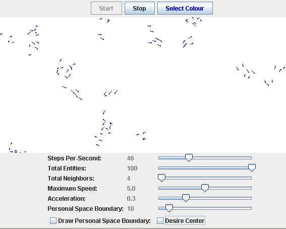

# Flocking

Archive of the Flocking project developed circa January 2003 by Jason Brownlee.

## About

[Flocking](https://en.wikipedia.org/wiki/Flocking_(behavior)) is a emergent behaviour achieved through local agent-to-agent interaction rules. This flocking implementation simply employs the local rules specified for flocking by Craig Reynolds on his [Boids website](https://web.archive.org/web/20060820211920/http://www.red3d.com/cwr/boids/) (archived).

To summarise the three local rules employed are as follows:

1. Separation - steer to avoid collisions
2. Alignment - steer toward the average heading of neighbours
3. Cohesion - steer toward the average position of neighbours

## Code

Code implementation in Java, providing a swing graphical user interface with user controls.

Its all about neighbours. The aspect I wanted to highlight in this implementation is that the global behaviour observed is controlled by each agents local interactions with its neighbours. The underlying API if flexible and can be easily extended for more complex environments, interactions and multiple swarms. There are control parameters for the agents for things like maximum speed, acceleration, total agents.

More interesting are the parameters to control the local neighbourhood rules. These configuration parameters include total neighbours to evaluate, size of each agents personal space boundary. Another interesting feature is that each agents personal space boundary can be displayed, which immediately aids in explaining their current behavioural patterns.

* Download: [flocking1.0.zip](flocking1.0.zip)

**Screenshot:**

## Sources

* [http://www.it.swin.edu.au/personal/jbrownlee/other/flocking/index.html](https://web.archive.org/web/20081121061108/http://www.it.swin.edu.au/personal/jbrownlee/other/flocking/index.html)

